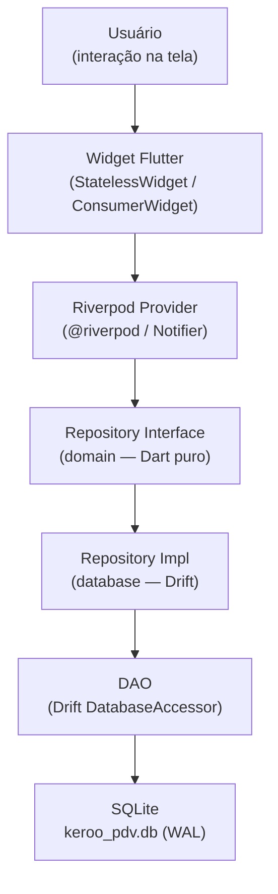
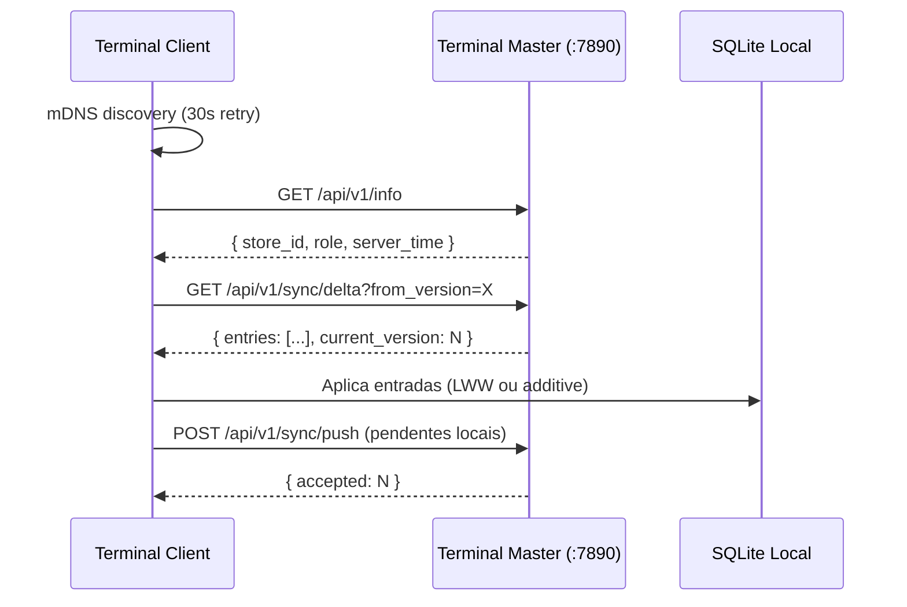

# Fluxo de Dados

Como os dados fluem desde a interação do usuário até o banco de dados SQLite.

## Camadas e Responsabilidades



## Exemplo: Finalizar uma Venda

### 1. UI (`pos_screen.dart`)
```dart
// Widget observa o provider de estado do carrinho
final cartState = ref.watch(cartProvider);

// Botão "Finalizar Venda" aciona o notifier
ElevatedButton(
  onPressed: () => ref.read(cartProvider.notifier).finalizeSale(payment),
)
```

### 2. Riverpod Notifier (`cart_provider.dart`)
```dart
@riverpod
class Cart extends _$Cart {
  Future<void> finalizeSale(PaymentMethod payment) async {
    final repo = ref.read(saleRepositoryProvider);
    await repo.finalizeSale(state.sale, payment);
    // Limpa o carrinho após sucesso
    state = CartState.empty();
  }
}
```

### 3. Domain — Interface de Repositório (`sale_repository.dart`)
```dart
abstract class SaleRepository {
  Future<void> finalizeSale(Sale sale, PaymentMethod payment);
}
```

### 4. Data — Implementação (`sales_repository_impl.dart`)
```dart
class SalesRepositoryImpl implements SaleRepository {
  final FinalizeSaleDao _dao;

  @override
  Future<void> finalizeSale(Sale sale, PaymentMethod payment) async {
    await _dao.finalizeSale(
      sale: _toCompanion(sale),
      payments: _toPaymentCompanions(payment),
    );
  }
}
```

### 5. DAO (`finalize_sale_dao.dart`)
```dart
@DriftAccessor(tables: [Sales, SaleItems, SalePayments, CashMovements, Inventory])
class FinalizeSaleDao extends DatabaseAccessor<AppDatabase> {
  Future<void> finalizeSale({...}) => transaction(() async {
    // 1. Atualiza status da venda para 'completed'
    // 2. Insere SalePayments
    // 3. Insere CashMovement tipo 'sale'
    // 4. Atualiza quantidade em Inventory
    // 5. Insere InventoryMovement tipo 'out'
    // 6. Insere SyncLogEntry para propagação
  });
}
```

### 6. SQLite (WAL)
A transação Drift é executada atomicamente no arquivo `keroo_pdv.db`.

## Streams Reativos

Para dados que precisam ser atualizados em tempo real (ex: lista de produtos no PDV), usa-se `Stream` do Drift:

```dart
// DAO retorna Stream
Stream<List<Product>> watchActiveProducts();

// Provider observa o stream
@riverpod
Stream<List<domain.Product>> products(Ref ref) {
  final repo = ref.watch(productRepositoryProvider);
  return repo.watchAll();
}

// Widget reage automaticamente
ref.watch(productsProvider).when(
  data: (products) => ProductGrid(products: products),
  loading: () => const CircularProgressIndicator(),
  error: (e, _) => ErrorWidget(e.toString()),
)
```

## Fluxo de Sincronização (Background)



A sincronização é **não-bloqueante**: o carrinho e o fechamento de venda nunca aguardam confirmação de rede.
