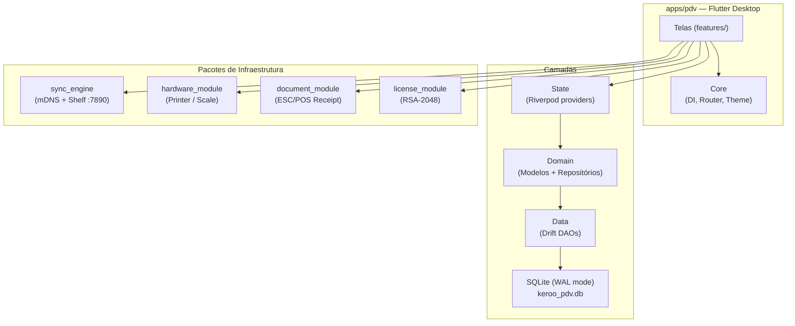

# Arquitetura

O keroo-pdv é uma aplicação desktop **offline-first** construída com Flutter. Esta seção documenta as decisões arquiteturais fundamentais do sistema.

## Visão Geral



## Princípios

### Offline-First
Toda venda é confirmada localmente no SQLite **antes** de qualquer comunicação de rede. A sincronização entre terminais acontece em segundo plano e nunca bloqueia o operador de caixa.

### Management First, Fiscal Later
O MVP não emite documentos fiscais. O schema do banco já contém todos os campos fiscais (NCM, CFOP, CST), mas eles são ocultados na UI quando `featureFlags.fiscalNfce == false`. A ativação acontece via flag de licença na v1.0.

### License-Controlled Features
Funcionalidades são ativadas remotamente por meio da chave de licença, sem necessidade de atualizar o app. O `FeatureFlags` é derivado do payload RSA da licença.

## Camadas da Aplicação

| Camada | Responsabilidade | Tecnologia |
|---|---|---|
| **UI** | Telas, widgets, formulários | Flutter + Material 3 |
| **State** | Reatividade, cache, notificação | Riverpod 3.x (`@riverpod`) |
| **Domain** | Modelos, regras de negócio, interfaces de repositório | Dart puro (sem Flutter/IO) |
| **Data** | Implementações de repositório, DAOs, queries | Drift (SQLite) |
| **Hardware** | Impressora, balança, gaveta | Strategy pattern + `NullPrinter`/`NullScale` |
| **Sync** | Descoberta mDNS, servidor HTTP, protocolo delta | shelf + multicast_dns |
| **License** | Validação RSA offline, feature flags | pointycastle |

## Estrutura de Diretórios do App

```
apps/pdv/lib/
├── core/
│   ├── di/          → Providers de infraestrutura (database, hardware, license)
│   ├── router/      → go_router: rotas, guards de autenticação e feature flag
│   ├── theme/       → Tema Material 3
│   └── widgets/     → AppShell (sidebar + layout principal)
└── features/
    ├── auth/        → Login (PIN 3 dígitos), setup inicial
    ├── pos/         → Tela de venda, carrinho, pagamento
    ├── cashier/     → Abertura/fechamento de caixa, movimentações
    ├── inventory/   → Listagem de estoque, ajustes, histórico
    ├── products/    → Catálogo, categorias, preços
    ├── customers/   → Diretório de clientes
    ├── reports/     → Resumo diário, filtros por período
    ├── settings/    → Loja, hardware, licença, usuários
    └── sync/        → Status de sincronização, modo master/client
```

## Seções Relacionadas

- [Estrutura do Monorepo](monorepo.md)
- [Stack Tecnológico](tecnologias.md)
- [Fluxo de Dados](fluxo-de-dados.md)
- [Convenções Globais](convencoes.md)
