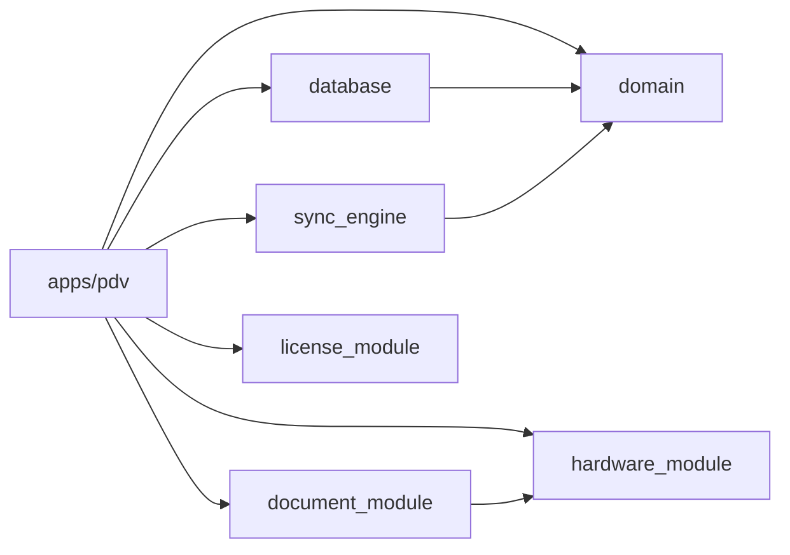

# Estrutura do Monorepo

O keroo-pdv é organizado como um **monorepo** gerenciado pelo [Melos](https://melos.invertase.dev/).

## Estrutura de Diretórios

```
keroo-pdv/
├── melos.yaml                  → Referência ao pubspec.yaml (Melos 7+)
├── pubspec.yaml                → Configuração do workspace + scripts Melos
├── CLAUDE.md                   → Regras e convenções para IAs (Claude/Cursor)
├── README.md                   → Visão geral do projeto
│
├── apps/
│   └── pdv/                    → App Flutter desktop (o executável final)
│       ├── lib/
│       │   ├── core/           → DI, router, tema, widgets globais
│       │   └── features/       → Uma pasta por feature do app
│       └── pubspec.yaml
│
└── packages/
    ├── database/               → Drift schema, DAOs, migrações
    ├── domain/                 → Modelos Freezed, interfaces de repositório
    ├── document_module/        → Gerador de comprovante ESC/POS
    ├── hardware_module/        → Interfaces e impls de impressora/balança
    ├── sync_engine/            → Servidor mDNS + Shelf HTTP + cliente de sync
    └── license_module/         → Validação RSA-2048 + feature flags
```

## Apps vs Packages

| Tipo | Localização | Regra |
|---|---|---|
| **App** | `apps/` | Contém a UI Flutter, providers, router. Pode importar qualquer pacote. |
| **Package** | `packages/` | Sem dependência de outros packages (exceto `database` → `domain`). Sem Flutter widgets (exceto `hardware_module` que pode usar plugins nativos). |

## Dependências entre Pacotes



- `database` depende de `domain` (usa as interfaces de repositório)
- `sync_engine` depende de `domain` (usa `SyncLogRepository`)
- `document_module` depende de `hardware_module` (usa `PrinterInterface`)
- Os demais pacotes são **independentes** entre si

## Comandos Melos

Os scripts são definidos no `pubspec.yaml` raiz, sob a chave `melos:`:

```bash
# Instalar dependências de todos os pacotes
melos bootstrap

# Gerar código (Drift + Riverpod + Freezed)
melos run build_runner

# Rodar todos os testes
melos run test

# Lint + análise estática
melos run analyze
```

## Workspace Dart (Melos 7+)

A partir do Melos 7, a configuração do workspace usa `resolution: workspace` no `pubspec.yaml` de cada pacote, permitindo que o Dart resolva dependências de forma unificada. O `melos.yaml` na raiz é mantido apenas para compatibilidade com tooling (IDEs, CI).

## Adicionando um Novo Pacote

1. Crie o diretório em `packages/<nome>/`
2. Crie `pubspec.yaml` com `resolution: workspace`
3. Crie `README.md` (propósito, dependências permitidas, estrutura de arquivos)
4. Crie `CLAUDE.md` (convenções, o que NÃO fazer)
5. Execute `melos bootstrap`
6. Atualize o `README.md` raiz com o novo pacote

> **Nunca crie** `packages/fiscal_module` — este módulo só existe a partir do Sprint 11 (v1.0).
