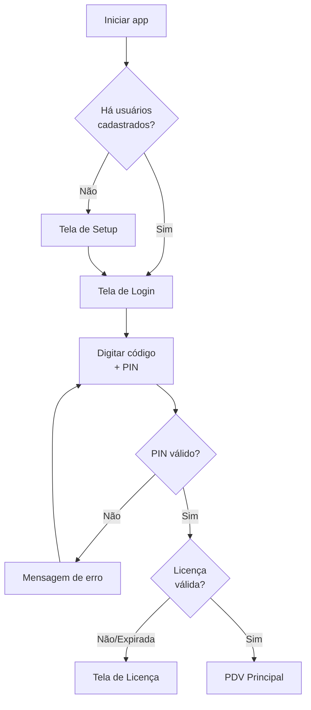

# Autenticação

O keroo-pdv usa um sistema de login rápido por **código de operador + PIN de 3 dígitos**, projetado para trocas de turno ágeis no PDV.

## Fluxo de Autenticação

## Login por PIN

- O operador digita um **código de 3 dígitos** (ex: `001`, `042`)
- Em seguida digita o **PIN de 3 dígitos** correspondente
- A verificação é feita localmente via bcrypt (`pin_hash` na tabela `users`)
- Nenhuma conexão de rede é necessária para autenticar

## Roles (Papéis)

| Role | Acesso | Restrições |
|---|---|---|
| `admin` | Total | Pode criar/editar/desativar usuários, acessar todas as configurações |
| `manager` | Vendas + Caixa + Estoque + Relatórios | Sem gestão de usuários |
| `operator` | Vendas + Caixa | Sem acesso a relatórios, configurações, gestão |

## Setup Inicial

Na primeira execução (sem usuários cadastrados), o app exibe a tela de setup:

1. Dados da loja (nome, CNPJ, endereço)
2. Nome e PIN do administrador (código `001` por padrão)

O setup só é exibido uma vez. Após criar o admin, o app redireciona para o login normal.

## Gestão de Usuários

**Acesso**: Configurações → Usuários (somente `admin`)

- **Criar operador**: nome, PIN, role
- **Editar operador**: atualizar nome, PIN, role
- **Desativar/reativar**: toggle do campo `active` (sem soft delete de usuários)

> Usuários nunca são deletados fisicamente. Apenas desativados (`active = false`).

> O código do operador (`operator_code`) é sequencial e único. Definido no cadastro.

## Segurança

- PINs são armazenados como **bcrypt hash** no campo `pin_hash`
- Nunca logar PINs, hashes ou tokens
- Sem sistema de "esqueci o PIN" — o admin deve redefinir o PIN do operador
- O admin pode alterar o próprio PIN apenas pelo fluxo de edição de usuário
