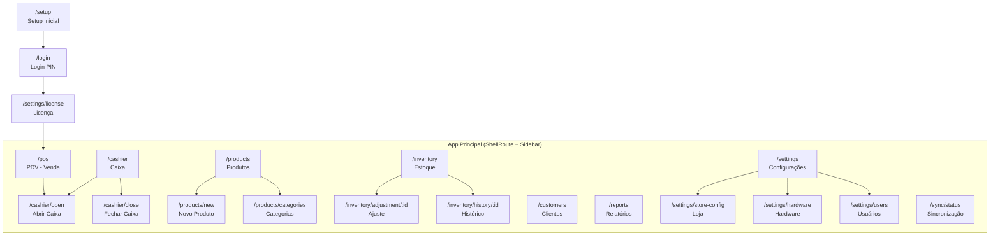

# Funcionalidades

Guia de uso das telas e funcionalidades do keroo-pdv.

## Mapa de Navegação

## Guards de Acesso

| Rota | Guard | Comportamento |
|---|---|---|
| Todas (exceto `/setup`, `/login`) | Autenticação | Redireciona para `/login` se não autenticado |
| Todas (exceto `/settings/license`) | Licença | Redireciona para `/settings/license` se licença inválida/ausente |
| `/settings/fiscal` | Feature flag | Redireciona para `/settings` se `fiscalNfce == false` |
| `/settings/users*` | Role admin | Redireciona para `/settings` se não for admin |

## Seções das Funcionalidades

| Funcionalidade | Link |
|---|---|
| Autenticação e usuários | [autenticacao.md](autenticacao.md) |
| PDV — tela de venda | [pdv.md](pdv.md) |
| Caixa | [caixa.md](caixa.md) |
| Estoque | [estoque.md](estoque.md) |
| Produtos e categorias | [produtos.md](produtos.md) |
| Clientes | [clientes.md](clientes.md) |
| Relatórios | [relatorios.md](relatorios.md) |
| Configurações | [configuracoes.md](configuracoes.md) |
| Sincronização | [sincronizacao.md](sincronizacao.md) |
