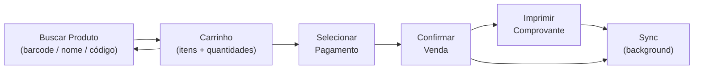

# PDV — Tela de Venda

A tela de PDV (`/pos`) é a tela principal do sistema. Concentra todo o fluxo de registro de venda.

## Pré-condições

- Usuário autenticado
- Caixa aberto (`status = 'open'` em `cash_registers`)

Se o caixa estiver fechado, o PDV exibe um aviso e redireciona para a tela de abertura de caixa.

## Fluxo de Venda

## Adicionar Itens ao Carrinho

### Por Código de Barras
Escaneie ou digite o código de barras. O produto é encontrado e adicionado com quantidade 1.

### Por Busca de Nome
Digite parte do nome do produto. Uma lista de sugestões é exibida.

### Produto Pesável
Se o produto tem `weighable = true`:
1. O PDV lê o peso da balança automaticamente
2. O peso é exibido no campo de quantidade
3. O operador pode ajustar manualmente se necessário

### Ajustar Quantidade / Desconto
Clique no item no carrinho para editar:
- Quantidade (inteira ou decimal para KG)
- Desconto por item (em reais ou percentual)

## Formas de Pagamento

| Código | Descrição |
|---|---|
| `cash` | Dinheiro |
| `pix` | PIX |
| `debit_card` | Cartão de Débito |
| `credit_card` | Cartão de Crédito |
| `store_credit` | Crédito na Loja (conta corrente do cliente) |
| `other` | Outro |

Uma venda pode ter **múltiplas formas de pagamento** (pagamento misto). A soma dos pagamentos deve cobrir o total da venda.

## Finalização da Venda

1. Confirmar valor pago por forma de pagamento
2. Verificar troco (para pagamento em dinheiro)
3. Confirmar

A venda é **imediatamente persistida no SQLite** (status `completed`). A impressão do comprovante e a sincronização acontecem após a confirmação.

## Impressão do Comprovante

- Imprime automaticamente se uma impressora estiver configurada
- Falha na impressão **não reverte a venda**
- É possível reimprimir a última venda no botão "Reimprimir"

## Venda com Cliente Identificado

Opcional: vincular a venda a um cliente cadastrado.

1. Clique em "Identificar Cliente"
2. Busque por nome, CPF ou telefone
3. Confirme

O cliente é associado à venda (`customerId` em `sales`).

## Status da Venda

| Status | Descrição |
|---|---|
| `open` | Carrinho em edição |
| `completed` | Venda finalizada e paga |
| `cancelled` | Venda cancelada (registra estorno) |
| `suspended` | Venda suspensa temporariamente (ticket em espera) |
