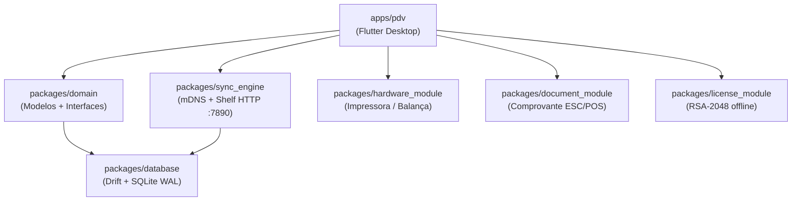

# keroo-pdv — Documentação

**keroo-pdv** é um sistema de Ponto de Venda (PDV) desktop offline-first para pequenos negócios brasileiros. Roda em **Windows** e **Linux**, construído com Flutter.

## Filosofia MVP

> "Gestão Primeiro, Fiscal Depois"

O MVP valida a velocidade de vendas e o controle de estoque/caixa **sem nenhuma integração fiscal**. O módulo NF-e/SAT é ativado na v1.0 via flag de licença — sem necessidade de re-entrada de dados pelo cliente.

## Arquitetura em 30 Segundos

O app é **offline-first**: todas as vendas são confirmadas localmente no SQLite antes de qualquer comunicação de rede. A sincronização entre terminais é um processo de fundo que nunca bloqueia o operador.

## Seções da Documentação

| Seção | Público | Descrição |
|---|---|---|
| [Início Rápido](inicio-rapido/index.md) | Todos | Instalação e primeiro uso |
| [Arquitetura](arquitetura/index.md) | Devs | Visão geral técnica do sistema |
| [Módulos](modulos/index.md) | Devs | Documentação de cada pacote |
| [Funcionalidades](funcionalidades/index.md) | Todos | Guia de uso das telas |
| [Banco de Dados](banco-de-dados/index.md) | Devs | Schema SQLite completo |
| [API de Sincronização](api/index.md) | Devs | Endpoints HTTP internos |
| [Desenvolvimento](desenvolvimento/index.md) | Devs | Ambiente, testes, convenções |
| [Roadmap](roadmap.md) | Todos | MVP vs v1.0 |

## Links Rápidos

- [Pré-requisitos](inicio-rapido/pre-requisitos.md)
- [Instalação](inicio-rapido/instalacao.md)
- [Primeiro uso](inicio-rapido/primeiro-uso.md)
- [Schema do banco de dados](banco-de-dados/tabelas.md)
- [Endpoints de sincronização](api/endpoints-sync.md)
- [Convenções de código](desenvolvimento/convencoes.md)
