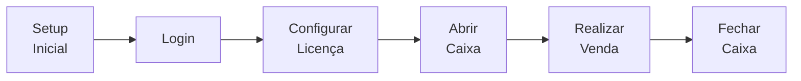

# Primeiro Uso

Guia passo a passo para a primeira utilização do keroo-pdv após a instalação.

## 1. Tela de Setup Inicial

Na primeira execução, o app detecta que não há usuários cadastrados e redireciona automaticamente para a tela de **Setup**.

Preencha:
- **Nome do estabelecimento**: razão social ou nome fantasia
- **CNPJ**: somente dígitos (ex: `12345678000195`)
- **Endereço**: aparecerá no comprovante
- **Nome do administrador**: nome do primeiro usuário
- **PIN do administrador**: 3 dígitos (ex: `001`)

> O PIN é um código sequencial de 3 dígitos usado no login rápido. O administrador pode criar outros operadores depois.

Após confirmar, o app cria o primeiro usuário com role `admin` e redireciona para o login.

## 2. Login

Na tela de login, insira o código do operador (3 dígitos) e o PIN correspondente.

O administrador criado no setup usa o código `001` por padrão.

## 3. Configurar a Licença

Após o primeiro login, se não houver licença válida, o app redireciona para **Configurações → Licença**.

Cole a chave de licença fornecida e confirme. A validação é feita offline via RSA — não é necessária conexão com a internet.

> Em ambiente de desenvolvimento, é possível pular esta etapa ou usar uma licença de teste gerada com o par de chaves de desenvolvimento.

## 4. Abrir o Caixa

Antes de realizar vendas, é obrigatório abrir um caixa:

1. Navegue para **Caixa** no menu lateral
2. Clique em **Abrir Caixa**
3. Informe o valor de abertura (troco inicial em dinheiro)
4. Confirme

O caixa agora está aberto e o PDV está liberado para vendas.

## 5. Cadastrar Produtos

1. Navegue para **Produtos** no menu lateral
2. Clique em **Novo Produto**
3. Preencha: nome, preço de venda, unidade de medida
4. Salve

Opcionalmente, configure:
- Código de barras (para leitura por scanner)
- Código interno
- Categoria
- Estoque inicial (em **Estoque → Ajuste**)

## 6. Primeira Venda

1. Navegue para **PDV** (tela principal)
2. Adicione produtos ao carrinho:
   - Digitando o código de barras/interno
   - Pesquisando por nome
3. Selecione a forma de pagamento (Dinheiro, PIX, Cartão de Débito, etc.)
4. Confirme o pagamento
5. O comprovante é impresso automaticamente (se uma impressora estiver configurada)

## 7. Fechar o Caixa (Final do Dia)

1. Navegue para **Caixa**
2. Clique em **Fechar Caixa**
3. Informe o valor contado em caixa
4. Confirme — o relatório de fechamento é gerado e impresso

## Fluxo Resumido

