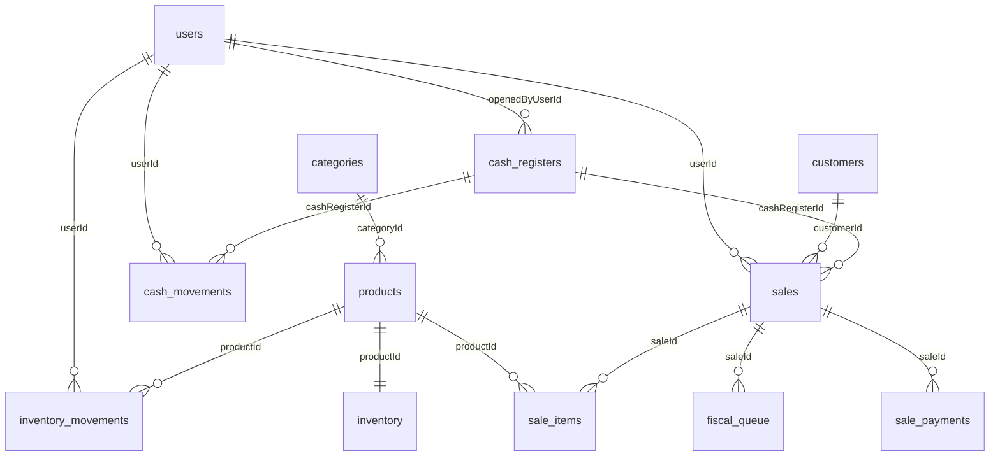

# Schema do Banco de Dados

O `AppDatabase` contém **15 tabelas** definidas com Drift. Todas usam UUID como chave primária e datas em ISO-8601 UTC.

Para a referência completa com colunas e tipos, veja [banco-de-dados/tabelas.md](../../banco-de-dados/tabelas.md).

## Tabelas e Agregados

## Lista das 15 Tabelas

| # | Nome Dart | Tabela SQL | Agregado |
|---|---|---|---|
| 1 | `Users` | `users` | Autenticação |
| 2 | `Categories` | `categories` | Catálogo |
| 3 | `Customers` | `customers` | Clientes |
| 4 | `Products` | `products` | Catálogo |
| 5 | `Inventory` | `inventory` | Estoque |
| 6 | `InventoryMovements` | `inventory_movements` | Estoque (append-only) |
| 7 | `CashRegisters` | `cash_registers` | Caixa |
| 8 | `CashMovements` | `cash_movements` | Caixa (append-only) |
| 9 | `Sales` | `sales` | Venda |
| 10 | `SaleItems` | `sale_items` | Venda |
| 11 | `SalePayments` | `sale_payments` | Venda |
| 12 | `FiscalQueue` | `fiscal_queue` | Fiscal (v1.0) |
| 13 | `SyncLog` | `sync_log` | Sincronização |
| 14 | `Licenses` | `licenses` | Licença |
| 15 | `StoreConfigs` | `store_configs` | Configuração |

## DAOs

| DAO | Tabelas | Responsabilidade |
|---|---|---|
| `ProductsDao` | `products`, `categories` | CRUD de produtos e categorias |
| `InventoryDao` | `inventory`, `inventory_movements`, `products`, `users` | Estoque + movimentos |
| `SalesDao` | `sales`, `sale_items`, `sale_payments` | Consultas de vendas e pagamentos |
| `CashRegistersDao` | `cash_registers`, `cash_movements`, `users` | Caixa + movimentos + relatórios |
| `FinalizeSaleDao` | `sales`, `sale_items`, `sale_payments`, `cash_movements`, `inventory` | Transação atômica de finalização |
| `SyncLogDao` | `sync_log` | Log de sincronização |
| `UsersDao` | `users` | CRUD de usuários |
| `StoreConfigDao` | `store_configs` | Configuração da loja (single-row) |
| `LicensesDao` | `licenses` | Upsert e leitura de licença |
