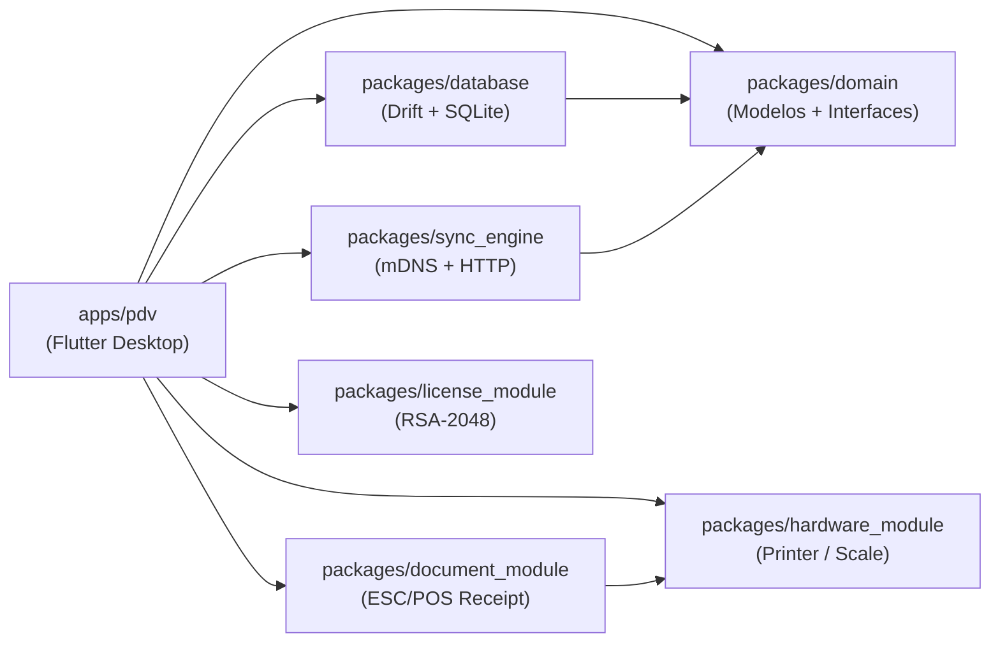

# Módulos

O keroo-pdv é um monorepo com **6 pacotes** e **1 app**. Cada pacote tem uma responsabilidade bem definida e boundary explícito.

## Mapa de Dependências

## Resumo dos Pacotes

| Pacote | Responsabilidade | Dependências externas principais |
|---|---|---|
| [database](database/index.md) | Schema Drift, DAOs, migrações SQLite | `drift`, `path_provider` |
| [domain](domain/index.md) | Modelos Freezed, interfaces de repositório | `freezed_annotation` |
| [sync_engine](sync-engine/index.md) | Servidor HTTP, descoberta mDNS, protocolo delta | `shelf`, `multicast_dns` |
| [hardware_module](hardware/index.md) | Impressora ESC/POS, balança serial, gaveta | `libserialport`, `esc_pos_utils` |
| [document_module](documentos/index.md) | Geração de comprovante e relatório de caixa | `hardware_module` |
| [license_module](licenca/index.md) | Validação RSA offline, feature flags | `pointycastle`, `flutter_secure_storage` |

## Regras de Boundary

- **`database`** não importa Flutter widgets — é Dart puro + Drift
- **`domain`** não importa nenhum pacote interno — é completamente puro
- **`sync_engine`** não acessa o banco diretamente — usa `SyncLogRepository` do `domain`
- **`hardware_module`** e **`license_module`** são independentes entre si
- Somente **`apps/pdv`** pode importar todos os pacotes
