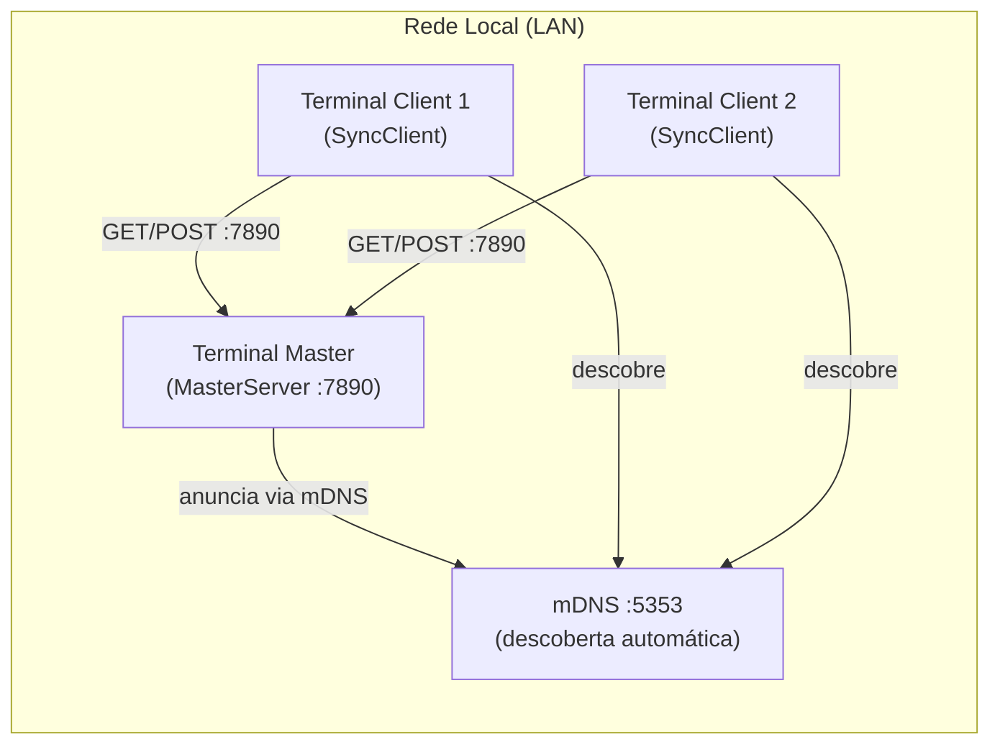
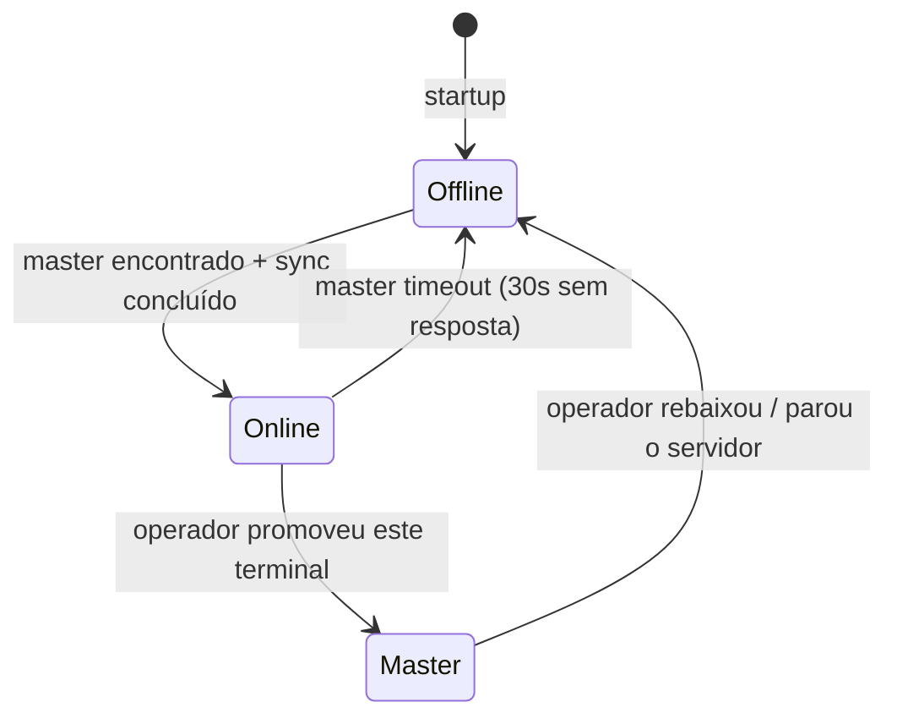

# Módulo: sync_engine

O pacote `sync_engine` implementa a sincronização de dados entre terminais na mesma rede local (LAN), sem dependência de internet.

## Arquitetura Master/Client



## Definição do Master

- O terminal **master é definido manualmente** pelo operador em Configurações
- Não há eleição automática (sem Raft, sem Paxos)
- Um único terminal por loja pode ser master
- Qualquer terminal pode ser promovido: `SyncClient.promoteToMaster(storeId)`

## Os 3 Modos de Operação



## As 3 Fases do Protocolo

### Fase 1 — Descoberta (mDNS)
```
1. Cliente escaneia mDNS por 5 segundos no startup
2. Serviço anunciado: _keroopdv._tcp
3. Se master encontrado: GET /api/v1/info → verifica store_id
4. Se não encontrado: opera offline; nova tentativa a cada 30s
```

### Fase 2 — Sincronização Delta
```
GET  /api/v1/sync/status
     → { master_sync_version: int, server_time: string }

GET  /api/v1/sync/delta?from_version=X&tables=products,inventory,customers
     → aplica: se incoming.sync_version > local.sync_version → aceita

POST /api/v1/sync/push
     → body: List<SyncLogEntry> onde synced = false
     → master confirma: { accepted: int }
```

### Fase 3 — Reserva de Estoque (Tempo Real)
```
1. Venda é confirmada LOCALMENTE primeiro (caixa nunca bloqueia)
2. POST /api/v1/stock/reserve (não-bloqueante, fire-and-forget)
3. Master valida disponibilidade e aplica decremento aditivo
4. Resposta STOCK_EXHAUSTED → alerta ao operador (venda já completa)
```

## Componentes

| Arquivo | Classe | Descrição |
|---|---|---|
| `master_server.dart` | `MasterServer` | Servidor Shelf HTTP + anunciador mDNS |
| `sync_client.dart` | `SyncClient` | Loop de descoberta + sync delta |
| `mdns_discovery.dart` | `MdnsDiscovery` | Usa `MDnsClient` do `multicast_dns` |
| `conflict_resolver.dart` | `ConflictResolver` | LWW + delta aditivo para inventário |
| `models/sync_protocol.dart` | — | Request/response models do protocolo |
| `models/sync_mode.dart` | `SyncMode` | Enum: `online`, `offline` |

## Seções Relacionadas

- [API HTTP — 5 endpoints](api.md)
- [Resolução de conflitos](resolucao-conflitos.md)
- [Endpoints de sincronização (referência)](../../api/endpoints-sync.md)
